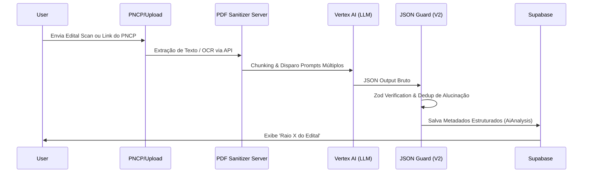

# LicitaSaaS - Documentação Arquitetural 🏗️

Bem-vindo à arquitetura técnica do LicitaSaaS. Este documento serve como o mapa principal do desenvolvedor para entender as engrenagens que movem a plataforma, abrangendo a separação entre Frontend / Backend, gestão de estado, motor de extração de IA e governança sistêmica.

---

## 1. Visão Geral (Tech Stack)

O LicitaSaaS possui uma arquitetura Full-Stack modular orientada a agentes locais de captura e micro-processamento em Nuvem.

- **Frontend:** React 18, TypeScript, Vite. Padrão SPA clássico mantendo responsividade. Usa componentes isolados e Hooks para injeção de dependência via contexto raiz.
- **Estilização:** CSS Vanilla (`index.css`), usando Design System fortemente baseado em CSS Variables (tokens) para temas (*Dark Mode* escalável).
- **Backend (Node.js):** Micro-rotas API (`server/services/`) com Express/Koa ou rotas standalone.
- **Banco de Dados (Realtime):** Supabase (PostgreSQL para dados estruturados, RLS, Storage para PDFs) e Firebase/Firestore para fluxos de chat e mensagens efêmeras/realtime do *Chat Monitor*.
- **IA Backbone:** Google Gemini Pro (2.5 / 3.1) e Vertex AI, alocados como a *engine* principal para classificação léxica textual e OCR de Editais complexos.

---

## 2. Princípios de Frontend (Modularidade Base)

Historicamente, o LicitaSaaS lidou com monolitos de UI. Hoje, o projeto está estabilizado no **"Padrão Nota 10"**, que dita as seguintes regras invioláveis:

* **Regra de Ouro (Tamanho < 500 Linhas):** Nenhum arquivo de interface (`.tsx`) deve exceder 500/600 linhas. Caso isso ocorra, é compulsório dividi-lo em abas, blocos, iteradores ou em sub-componentes.
* **Containers Inteligentes vs Views Burras:** Lógicas de alto nível (API, estado em massa, refetch) vivem em *Custom Hooks* (ex: `useChatMonitor`, `useProposalWizard`). As Views recebem `props` e repassam callbacks limpos.
* **Performance e Reactivity:** Utilizar severamente `React.memo` para Listas Massivas (ex: Itens de chat do Supabase, listas de Cards no Kanban) para evitar *Memory Leaks* ao instanciar WebSockets.

---

## 3. Principais Subsistemas

### 3.1 O Funil (Kanban e Processos Múltiplos)
O coração da mesa de operações do LicitaSaaS. 
- Gerenciado principalmente no `src/components/KanbanBoard.tsx`.
- Faz uso pesado de persistência *Optimistic UI* usando Drag & Drop e React context via `useLicitacoes()`.
- O Funil isola o Kanban (operações manuais e avanço de fase) do Motor de IA, usando o Kanban *Cards* como um *gateway* de estado simplificado.

### 3.2 Motor de Análise de Editais IA (O Cerebro V3)
O núcleo da vantagem competitiva técnica. Ele digere dezenas de páginas de PDF em dados rastreáveis.
* **Componentes:**
  * **Ingestão (`server/services/ai/processManager`)**: Lê e processa Documentos (PNCP Scraping ou Uploads Manuais).
  * **Pipeline Híbrido (`ExtractionPipeline`):** Divide a análise em blocos léxicos paralelos para quebrar o limite de tokens da API:
     * *Vedações e Riscos.*
     * *Prazos, Finanças.*
     * *Habilitações e Qualificações (Engenharia de Prompt Específica V3 para QTO).*
  * **Sanitização Universal (`Sanitizer`):** Dedup server-side de itens repetidos/alucinados do Modelo. Garante 100% de Schema Validation estrito antes de popular o Supabase.
  * **Relatório Visual (`AiReportModal.tsx`):** Componente multi-tab que consome os JSONs salvos e correlaciona as exigências (`CategorizedDocs`) com a Biblioteca Central de Atestados da empresa.

### 3.3 Motor de Propostas (Envelope V3)
Sistema arquitetado para escalar e isolar lógicas de Propostas "Iniciais" e "Readequadas", minimizando regressões.
- **Hook Gestor:** `useProposalWizard.ts` contém 100% da álgebra de cálculo financeiro e mutações CRUD.
- **Etapas Visuais:** Localizadas em `src/components/proposals/letter/steps/`. Cada fase da Proposta atua apenas sobre a edição de dados sem salvar no banco de dados.
- O estado local reflete o formato *Envelope V3* no Supabase apenas ao concluir a guia final. 

### 3.4 Monitor de Chat BBMNET/ComprasNet (O Rastreador)
Arquitetura *Realtime WebSocket* híbrida projetada para escalar milhões de bytes de JSONs por segundo dos portais.
- A **Catcher Engine**: Interceptor Chrome Extension / Puppeteer que roda isolado na máquina de extração (Worker do cliente ou Server-side), empurrando requisições interceptadas (XHR) via API para o Firebase Firestore em nuvem.
- O **ChatMonitorPage.tsx**: Frontend que lê `onSnapshot` do Firestore; usando a estratégia de `React.memo` para `MessageItems`, protegendo a UI Thread de crashes.
- Inclui mecanismos avançados de *Busca Global* e alertas com Dicionário RegEX customizado.

---

## 4. Sistema de Governança (Modo Blindado)
Presente em `src/governance/index.ts`, este é o porteiro (*Gatekeeper*) que rege a Regra de Negócios universal do app em Produção.
* Ao invés de *if/else* soltos no cliente sobre o Status da Licitação (ex: "Publicado", "Disputa"), toda rotina aciona `resolveStage` e `isModuleAllowed`.
* Desacoplar isso do Back-end impede ações fantasma na API, sendo imposto um controle de acesso duplo na interface gráfica e nas API rotas.

---

## 5. Fluxogramas Críticos e Árvores de Decisão

### A. Fluxo de Decodificação do PDF -> Dados (AI)


### B. Ciclo de Vida da Governança UI
```mermaid
graph TD
    A[Usuário tenta clicar num Botão de Ação] --> B(Gatekeeper de Governança)
    B --> C{resolveStage(status)?}
    C -->|Homologado / Adjudicado| D[Isola Módulo / Block]
    C -->|Publicado / Disputa| E[Módulo Allowed]
    D --> F[Mostra GovernanceBlockedBanner]
    E --> G[Ação Permitida + Executa Função]
```

## 6. Práticas DevOps

- Sempre garantir o check das variáveis de ambiente críticas: `VITE_SUPABASE_URL`, `VERCEL_ENV`, `VERTEX_API_ID`.
- Testes prioritários em novos fluxos: E2E para Upload do Edital via playwright, garantindo que o RAG local suporta o prompt multi-camadas 3.1.
- *Deploy* obedece à regra do `Plano de Execução Blindado`, realizando rollouts sequenciais apenas após checagem das chaves da IA Primária / Secundária.
